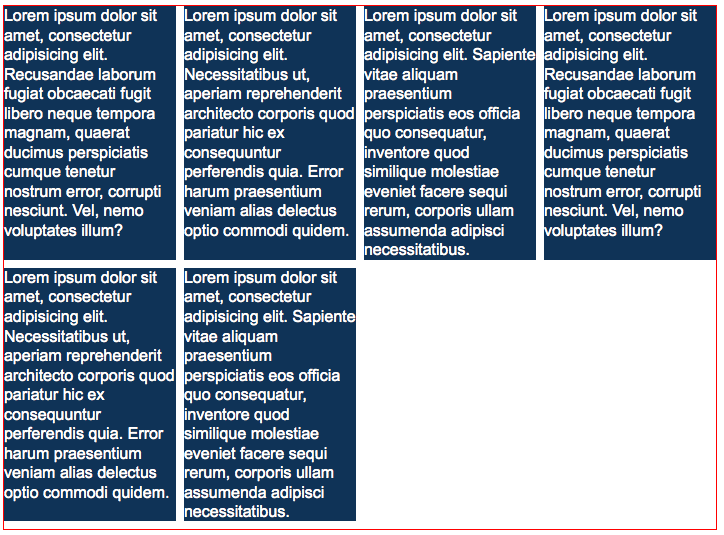

036_flexbox_reihen_spalten
========
Mehrspaltiges Layout mit Flexbox

### Angabe:

Baue das Layout nach, wie es in der Vorgabe zu sehen ist. Alle Artikel sollen 8px Abstand nach rechts haben (Die Breite muss entsprechend angepasst werden). Pro Reihe sollen nur vier Artikel dargestellt werden. Die vier Artikel müssen das Elternelement in der Breite komplett füllen.

In *nichtaendern.css* stehen mitunter relevante Information. Dieses Stylesheet darf nicht geändert werden.

