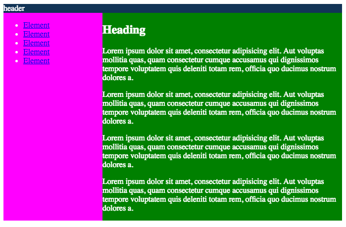

037_mediaqueries2
========
Media Query Grundlagen

### Angabe:

Das Layout soll sich so verhalten wie in [Vorgabe1](vorgabe_1.png) und [Vorgabe2](vorgabe_2.png). Die break-points sollen bei 700px und 1024px greifen.

Ab 1024px hat das Design eine Maximalbreite von 1024px und ist zentriert.

